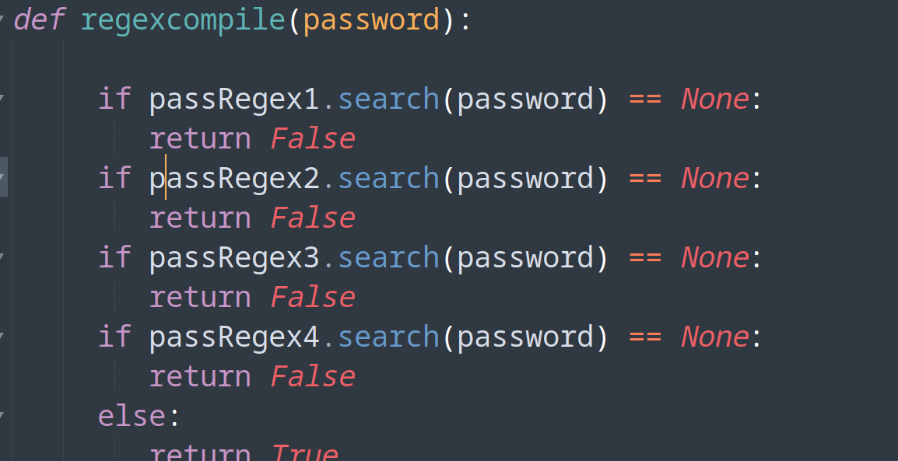
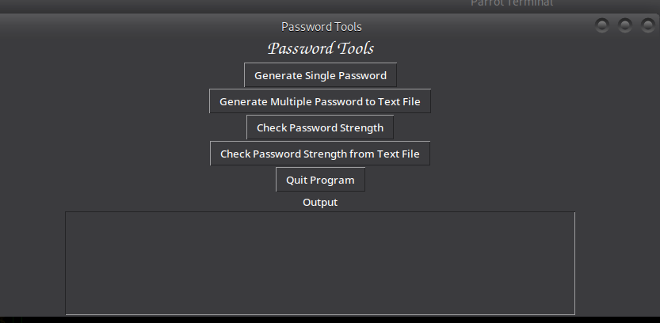
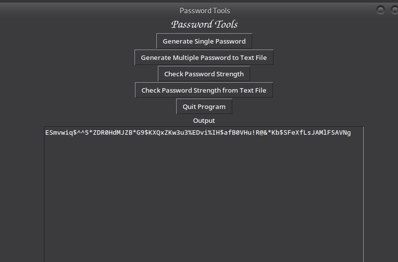
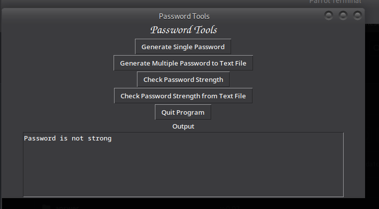

# Password-in-Python-and-Tkinter-interface

Security is a major concern in todays organisation, In order to ensure security and password strength in order to prevent password brute force and password guessing, I implemented this tkinter interface to validate and check password strength

Password Generator, Strength checkers and Validation using Python and Tkinter framework interface

## At work!!
#Images showing how this code works!!

# Usage

step 1

## clone this repository
$ https://github.com/Pelekingz/Password-in-Python-and-Tkinter-interface.git

step 2 

## navigate to the password directory
$ cd Password-in-Python-and-Tkinter-interface

### then
$ cd password

step 3 
### run
$ Python3 password.py
